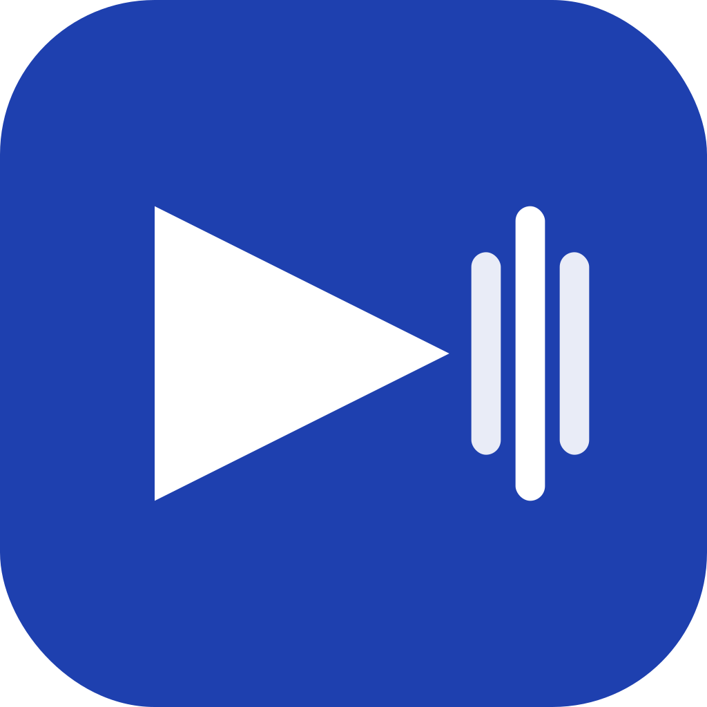
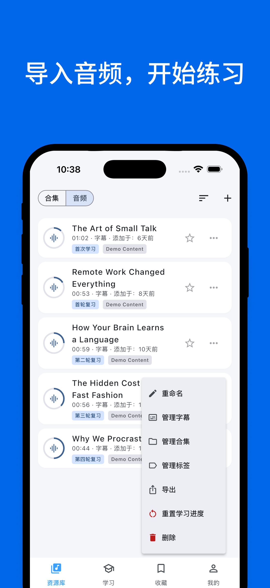
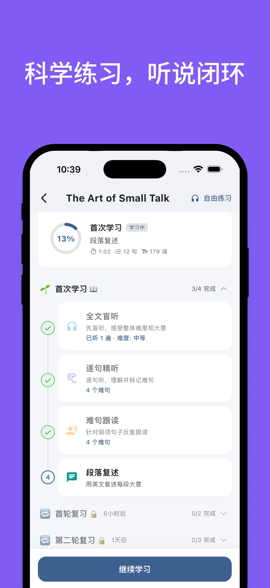
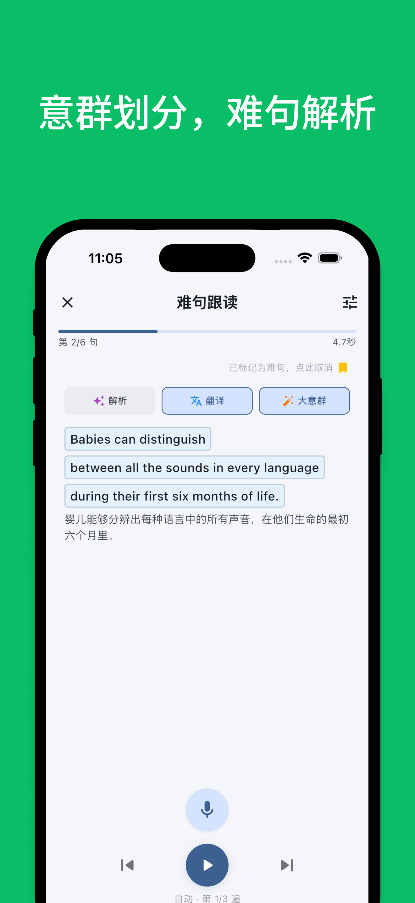
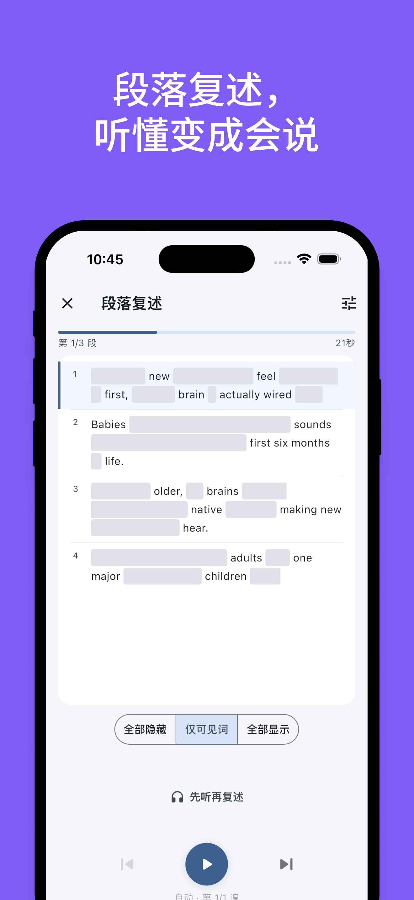
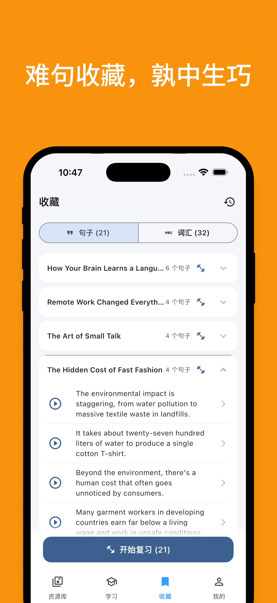
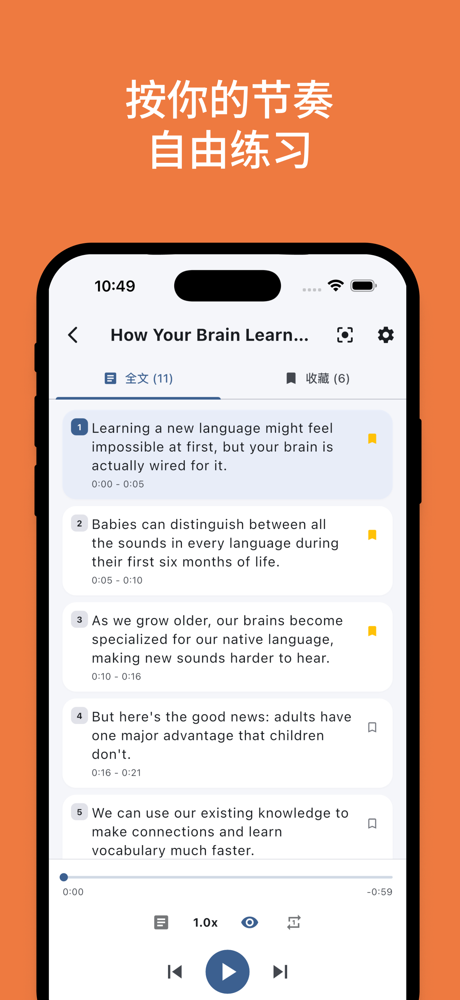

<div align="right">
  <a href="#">English</a> | <strong>简体中文</strong>
</div>

<div align="center">
  

  <h1>Echo Loop</h1>

  <p><strong>不必自己摸索怎么练好英语。</strong></p>

  <p>盲听 · 精听 · 跟读 · 复述 · 复习 —— Echo Loop 按科学节奏推你走完。</p>

  <p><sub>本项目由中央民族大学外国语学院翻译系 <a href="https://sfs.muc.edu.cn/info/1063/3729.htm">杨艳老师</a> 指导设计。杨老师获北京大学英语语言文学博士学位，主要研究英国维多利亚时代的文学与思想、中西思想在近现代的交汇。</sub></p>

  <p>
    <a href="./LICENSE"></a>
    
    <a href="https://github.com/echo-loop/Echo-Loop/commits/main"></a>
  </p>

  <p>
    <a href="#"></a>
  </p>
</div>

---

## 📱 截图

> App 已支持英文 UI，以下截图为中文模式。

<table>
  <tr>
    <td align="center"><br/><sub>导入音频，开始练习</sub></td>
    <td align="center"><br/><sub>科学练习，听说闭环</sub></td>
    <td align="center"><br/><sub>自动提醒，进步可见</sub></td>
    <td align="center"><br/><sub>逐句精听，难句标注</sub></td>
    <td align="center"><br/><sub>意群划分，难句解析</sub></td>
  </tr>
  <tr>
    <td align="center"><br/><sub>段落复述，听懂变成会说</sub></td>
    <td align="center"><br/><sub>难句收藏，熟中生巧</sub></td>
    <td align="center"><br/><sub>闪卡复习，原句再现</sub></td>
    <td align="center"><br/><sub>按你的节奏，自由练习</sub></td>
    <td align="center"></td>
  </tr>
</table>

---

## 🤔 我们为什么做这个

用其它英语 App 学习时，你得自己决定：今天听几遍？是该精听还是泛听？哪句话还没掌握？什么时候该复习？

**这些决策本身才是最消耗意志力的地方** —— 不是听不懂，是不知道下一步该做什么。

Echo Loop 把这些决定从你身上拿走。选好一段你想听懂的音频，按下开始 —— 从盲听到通关，App 推着你走，每一步告诉你"现在做什么"。一个素材跑完整段流程，比刷 100 个新单词更接近"会用"。

---

## 🆚 和其他方案的差异

挑了四款国内学习者最熟的 App 对比 —— 单看每一项功能，其它 App 也或多或少有；但 Echo Loop 真正的不同在于：**它把每一步串起来自动驱动你走完，你不需要自己摸索方法、控制遍数、掌握复习节奏。**

| 维度 | Echo Loop | 每日英语听力 | 可可英语 | 英语流利说 | Anki |
|---|---|---|---|---|---|
| **学习节奏由 App 驱动**（遍数 / 复习时机 / 难句归档自动决策） | ✅ 全自动 | ⚠️ 需手动控制 | ⚠️ 需手动控制 | ⚠️ 课程内固定 | ❌ 全靠用户管理 |
| 自由导入本地音频练习 | ✅ | ✅ 支持网盘/本地 + AI 字幕 | ❌ 平台素材为主 | ❌ 课程化 | ⚠️ 需自制卡片 |
| 听 → 说闭环（精听 + 跟读 + **复述**） | ✅ 三段完整 | ⚠️ 精听+跟读，无复述 | ⚠️ 精听+跟读，无复述 | ⚠️ 偏跟读 | ❌ |
| 跟读评测（音素/单词级打分） | ✅ iOS/macOS 原生 ASR + 命中词高亮 | ✅ 音素级打分 | ✅ 逐词打分 | ✅ 4 维度（词汇/发音/语法/流利度） | ❌ |
| **难句专项复习闭环**（不止收藏） | ✅ 收藏 → 专项跟读 → R1-R28 | ⚠️ 仅收藏 | ⚠️ 仅收藏 | ❌ | ⚠️ 需手动建卡 |
| **生词 → 闪卡 → 9 阶段 SRS 自动调度** | ✅ 一键，自动 R1-R28 | ⚠️ 生词本，复习简单 | ⚠️ 生词本，复习简单 | ❌ | ✅ 强大但需手动建卡 |
| 学习数据：时长 / 输入输出比 / 唯一词汇量 | ✅ 三件套 | ⚠️ 时长 + 词数 | ⚠️ 仅时长 | ⚠️ 仅时长 | ❌ |
| AI 翻译 / 句子解析 / 单词深度解析 | ✅ 内置四级缓存 | ⚠️ 仅翻译 | ⚠️ 翻译 + 词典 | ❌ | ⚠️ 第三方插件 |
| 离线可用 | ✅ | ✅ | ✅ | ⚠️ 部分 | ✅ |
| 开源 | ✅ GPL-3.0 | ❌ | ❌ | ❌ | ✅ AGPL |

> ⚠️ 表格信息整理于 2026-05，对手功能可能持续迭代，欢迎通过 Issue 提交更正。Echo Loop 真正与众不同的是把**复述训练 / 难句专项复习 / 9 阶段 SRS 自动调度 / 学习数据三件套**串成一个闭环 —— 每一项单独看其它 App 也都有部分实现，但没有一款把它们串到同一个学习节奏里。

---

## 🧠 学习方法论

一句话：**盲听 → 精听 → 跟读 → 复述 → R1…R28 复习 → 通关。**


**以上每一步，由 Echo Loop 自动驱动，不需要你判断。**

- **何时切下一阶段**：根据当前阶段完成度自动推进
- **每段练几遍**：根据难度和你的表现动态调整
- **难句怎么挑出来专项练**：你标注的 + 跟读未命中的，自动归档到难句库
- **什么时候复习**：R1、R2、R4 …… R28，9 阶段间隔自动调度，不靠日历提醒

你不需要管"现在该听几遍"、"上次那个素材该不该复习了"。打开 App，今天该做什么会直接呈现在你眼前。

学习全过程量化：**学习时长 · 输入输出比 · 唯一词汇量**。

<details>
<summary><strong>为什么是 R1–R28？</strong></summary>

Echo Loop 把每个素材拆成 9 个间隔复习阶段。从 1 天到 28 天逐步拉长，让大脑在快要遗忘时重新触达记忆痕迹，符合艾宾浩斯遗忘曲线 + Leitner box 的复合调度。

| 阶段 | 间隔 | 任务 |
|---|---|---|
| R1 | 1 天 | 全文盲听 + 难句跟读 |
| R2 | 2 天 | 单句精听 + 收藏复盘 |
| R3 | 4 天 | 跟读评测 + 段落复述 |
| R4 | 7 天 | 闪卡 + 收藏播放 |
| R5 | 11 天 | 全文盲听 + 难句跟读 |
| R6 | 15 天 | 跟读评测 |
| R7 | 19 天 | 闪卡 + 段落复述 |
| R8 | 24 天 | 全文盲听 |
| R9 | 28 天 | 通关检验：盲听 + 不看字幕跟读 + 总结复述 |

> 实际间隔与任务以代码实现为准，详见 `lib/providers/listening_practice/`。

</details>

---

## 🎬 Demo

<!-- TODO: 录制后替换 -->
<table>
  <tr>
    <td align="center"><br/><sub>跟读评测：原生 ASR + 命中词高亮</sub></td>
    <td align="center"><br/><sub>闪卡复习：R1-R28 自动调度</sub></td>
  </tr>
</table>

---

## ✨ 功能

- 🤖 **自动节奏驱动** —— 当前阶段、复习时机、难句归档全部自动推进，你只负责听和说
- 🎧 **合集与音频管理** —— 创建合集，导入本地音频（任意格式）+ SRT/VTT 字幕
- ▶️ **三种播放模式** —— 全文 / 单句 / 收藏，按精听节奏自由切换
- 🔁 **灵活循环 + 速度调节** —— 1–10 次循环、0–10s 间隔、0.5x–2x 变速
- 🤖 **AI 翻译 / 解析 / 单词深度解析** —— 四级缓存（内存 / SQLite / API / Postgres）
- 🎙️ **录音与跟读评测** —— iOS/macOS 原生 ASR + LCS 文本匹配 + 教练式反馈
- 🗂️ **R1–R28 间隔复习闪卡** —— 9 阶段自动调度，断点续学
- 📊 **学习数据统计** —— 时长、输入输出比、唯一词汇量
- 🌗 **响应式 UI** —— 移动底部导航 / 桌面侧边导航；浅色/深色/跟随系统
- 🌐 **国际化** —— 简体中文 / English

---

## 📥 下载与试用

<table>
  <tr>
    <td>
      <p><strong>iOS</strong> &nbsp;<a href="#"></a></p>
      <p><strong>Android</strong> &nbsp;<a href="https://github.com/echo-loop/Echo-Loop/releases"></a> <sub>从 GitHub Releases 或 <a href="#">官网</a> 下载 APK</sub></p>
      <p><sub>🖥️ <strong>macOS</strong>：开发中，敬请期待</sub></p>
      <p><sub>🪟 <strong>Windows</strong>：规划中</sub></p>
      <p><sub>🌐 <strong>Web</strong>：暂无支持计划</sub></p>
    </td>
    <td align="center" width="160">
      <br/>
      <sub>扫码下载 iOS 版</sub>
    </td>
  </tr>
</table>

---

## 🚀 开发者快速开始

```bash
git clone git@github.com:echo-loop/Echo-Loop.git
cd Echo-Loop
flutter pub get
dart run build_runner build
flutter run -d <macos|chrome|ios|android>
```

更多命令见末尾「开发命令速查」折叠区。

---

## 🗺️ Roadmap

| ✅ 已完成 | 🚧 进行中 | 🔭 计划中 |
|---|---|---|
| AI 翻译 / 解析 / 单词深度解析 | 录音 + 识别精度持续优化 | AI 数字人陪练（口语对话伙伴） |
| iOS/macOS 原生 ASR 跟读评测 | 跟读自动录音轮回打磨 | AI 解答助手（学习中随时提问） |
| 9 阶段间隔复习闪卡 | macOS 桌面版打磨 | 内容社群（合集分享 / UGC 材料） |
| 学习数据统计与可视化 |  | 连胜激励（streak / 学习勋章） |
|  |  | Android 原生 ASR |
|  |  | macOS / Windows 桌面版正式发布 |

详见 [PLAN.md](./PLAN.md) 和 [TASKS.md](./TASKS.md)。

---

## ⭐ Star History

[](https://star-history.com/#echo-loop/Echo-Loop&Date)

---

## 🎓 学术指导 & 致谢

**学术指导**

感谢 [杨艳老师](https://sfs.muc.edu.cn/info/1063/3729.htm)（中央民族大学外国语学院翻译系；北京大学英语语言文学博士）对本项目方法论的指导。方法论的语言学与教学法依据来自指导老师建议，开发实现由项目团队完成。

**核心依赖**

[just_audio](https://pub.dev/packages/just_audio) · [drift](https://pub.dev/packages/drift) · [flutter_riverpod](https://pub.dev/packages/flutter_riverpod) · [flutter_tts](https://pub.dev/packages/flutter_tts) · [subtitle](https://pub.dev/packages/subtitle) · [file_picker](https://pub.dev/packages/file_picker)

**示例素材**

`assets/demo/` 中的示例音频片段来自 BBC *English in a Minute*，仅供学习演示用途。

**贡献者**

[](https://github.com/echo-loop/Echo-Loop/graphs/contributors)

---

## 🤝 贡献

欢迎提 Issue / PR。提交前请运行：

```bash
flutter analyze
flutter test
```

Commit 风格遵循现有 `FEAT/FIX/CHORE/REFACTOR/CI/RELEASE` 前缀。详细贡献流程见 [CONTRIBUTING.md](#)（待补）。本项目遵循 [Contributor Covenant](https://www.contributor-covenant.org/) 行为准则。

---

## 📄 License

本项目以 **[GPL-3.0](./LICENSE)** 协议开源。

> 源码以 GPL-3.0 完全开源，欢迎 fork 自建。官方维护的 App 与服务后续可能引入付费功能（如云同步、AI 增值能力等）以支撑项目持续运营，付费功能不影响开源版本的核心学习能力。

---

<details>
<summary><strong>🛠️ 技术栈</strong></summary>


| 类别 | 技术 | 用途 |
|------|------|------|
| UI 框架 | Flutter + Material 3 | 跨平台 UI |
| 状态管理 | Riverpod（代码生成） | 单向数据流 |
| 音频播放 | just_audio + audio_session | 音频引擎层 |
| 字幕解析 | subtitle | SRT/VTT |
| 文件选择 | file_picker | 本地音频/字幕导入 |
| 数据持久化 | Drift (SQLite) + shared_preferences | 学习进度、收藏、缓存 |
| 国际化 | flutter_localizations + ARB | 简体中文 / English |
| 测试 | flutter_test + mocktail | 单元 / Widget / 集成 |
| 静态分析 | flutter_lints | 代码规范 |

</details>

<details>
<summary><strong>📁 项目结构</strong></summary>

```
lib/
├── l10n/              # 国际化翻译文件（ARB 格式）
├── models/            # 数据模型（AudioItem, Sentence, Collection 等）
├── providers/         # Riverpod 状态管理
│   ├── audio_engine/  # 音频引擎层（底层播放控制）
│   └── listening_practice/  # 听力练习层（业务逻辑）
│       ├── sentence_tracker.dart   # 句子定位（二分查找）
│       └── bookmark_manager.dart   # 书签管理
├── screens/           # 页面
├── services/          # 服务层（StorageService, SubtitleParser）
└── widgets/           # 可复用组件

integration_test/      # 端到端测试
test/                  # 单元 / Widget 测试
```

</details>

<details>
<summary><strong>⌨️ 开发命令速查</strong></summary>

**运行**

```bash
flutter run -d ios            # iOS
flutter run -d android        # Android
flutter run -d macos          # macOS（开发中，未发布）
flutter run -d chrome         # Web（仅调试用，无发布计划）

# iOS 模拟器
xcrun simctl list devices available
xcrun simctl boot <DEVICE_UDID>
open -a Simulator
```

**测试 / 质量检查**

```bash
flutter analyze                          # 静态分析
flutter test                             # 全部测试
flutter test integration_test -d macos   # 集成测试
dart format .                            # 格式化
```

**代码生成**（修改 Riverpod Provider 后）

```bash
dart run build_runner build
```

**构建**

```bash
flutter build macos
flutter build apk
flutter build ios

# 指定 API 地址
flutter build macos --dart-define=API_BASE_URL=https://dev.echo-loop.top
flutter build ios   --dart-define=API_BASE_URL=https://www.echo-loop.top

# 真机运行（指定 API 地址）
flutter run --release -d <DEVICE_ID> --dart-define=API_BASE_URL=https://dev.echo-loop.top
```

**环境要求**

- Flutter SDK 3.9.2+
- iOS 模拟器 / Android 模拟器 / 真机
- 桌面端：macOS / Windows / Linux 开发环境

</details>
